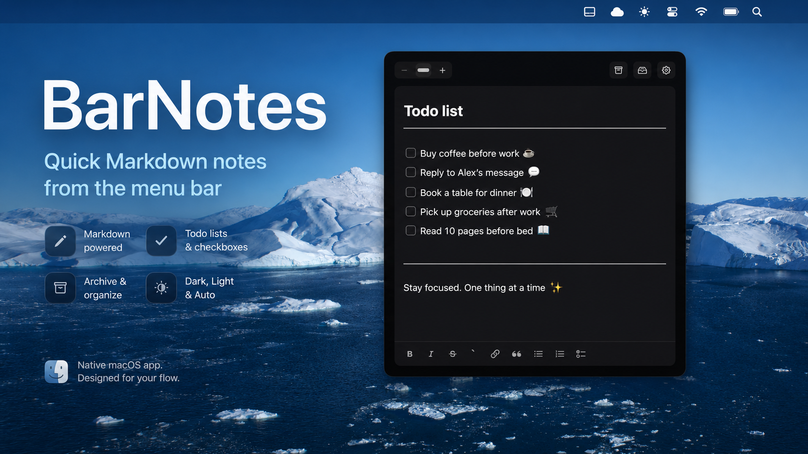

# BarNotes



BarNotes is a small native macOS note app that lives in the menu bar. Hover over the menu bar icon to open a compact Markdown notebook for quick tasks, links, screenshots, and tiny reminders.

BarNotes is forked from / based on [oil-oil/NotchNotes](https://github.com/oil-oil/NotchNotes), with modifications by [snowraind](https://github.com/snowraind). The original app focused on a note panel that unfolded from the MacBook notch. This fork changes the interaction model into a menu bar notebook, which works better on Macs without a notch and keeps the app anchored in the top-right system area.

## Download

- [Download the latest release](https://github.com/snowraind/BarNotes/releases/latest)
- [Open the homepage](https://snowraind.github.io/BarNotes/)

After downloading, unzip the app, move it to Applications, then right-click and choose Open on the first launch.

## Release Notes

### v0.1.3

- Fixed Markdown list continuation for unordered, ordered, and task lists.
- Improved live rendering around list markers, checkboxes, dividers, quotes, and strikethrough text.
- Added toolbar toggles for list formats so repeated clicks remove the format and other list buttons switch formats.
- Improved selected-line Tab indentation and aligned source/rendered Tab widths.
- Added a menu-bar style app icon and cleaned up the settings popover appearance.
- Stabilized panel height adjustment behavior.

## Features

- Menu bar notebook that opens on hover by default.
- Optional click trigger that opens the notebook from the menu bar icon.
- Live Markdown editing with formatting shortcuts and instant rendering for lists, checkboxes, dividers, quotes, and strikethrough text.
- Multiple note tabs for quick context switching.
- Archive notes with editable titles and restore them later.
- Paste images directly into notes.
- Dark, light, and automatic appearance modes.
- Keyboard shortcuts for editor font size.

## Markdown Editing

BarNotes keeps the underlying text as standard Markdown while rendering common syntax in place:

- `- item` renders as an unordered list item.
- `- [ ] task` renders as a checkbox task.
- `1. item` renders as an ordered list item.
- `---` renders as a full-width divider after the cursor leaves the line.
- `~~item~~` renders with strikethrough styling.
- `> item` renders as a quote with a left rule.

When the cursor returns to a syntax marker, BarNotes shows the Markdown source again so it stays easy to edit.

## Upgrade Notes

- Existing notes and archives are stored in the user's Preferences, not inside the `.app` bundle, so replacing the app in Applications keeps existing notes.
- BarNotes migrates data once from the old NotchNotes bundle identifier when needed.
- The internal storage keys still use the historical `notchNotes.*` names for compatibility.
- If you use an app cleaner that removes Preferences, export or back up your notes first.

## Changes From The Original

- Replaced the notch-centered hot zone with a menu bar icon trigger.
- Removed the always-visible notch mask for non-notch Macs.
- Added note archiving, restore, and delete flows.
- Added dark, light, and automatic appearance modes.
- Added editor font size shortcuts.
- Improved live Markdown rendering while keeping standard Markdown source text.

## Stack
- Swift + AppKit for the menu bar item, floating panel, window levels, and cursor-triggered behavior.
- SwiftUI for the notebook interface.
- UserDefaults for lightweight local note storage.
- MarkdownEngine for live Markdown editing and embedded images.

## Run

```bash
swift run BarNotes
```

After launch, move the cursor over the BarNotes menu bar icon. The notebook panel opens from the top-right corner.

## Package

```bash
./Scripts/package-app.sh
open BarNotes.app
```

## Distribution

The current downloadable ZIP is intended for testing. For public distribution outside the Mac App Store, sign the app with a Developer ID Application certificate and submit it for Apple notarization.
